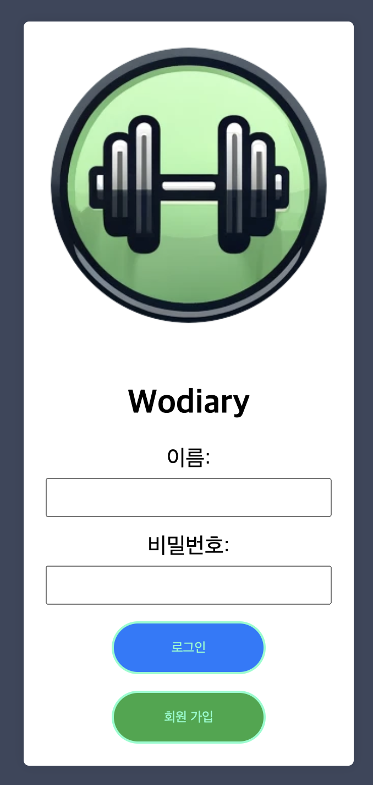
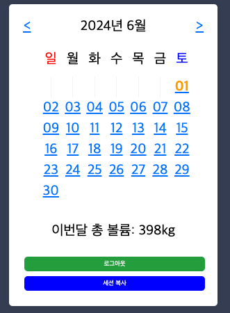
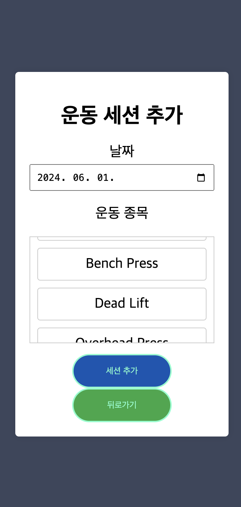
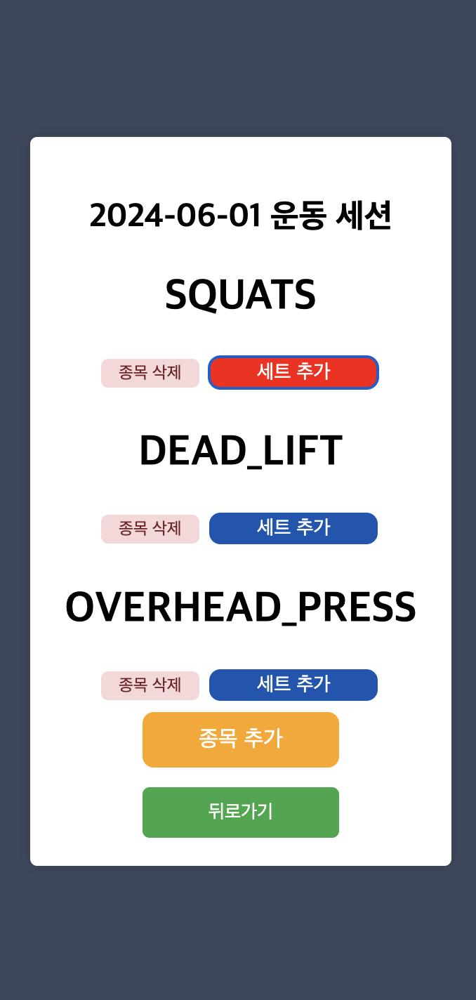
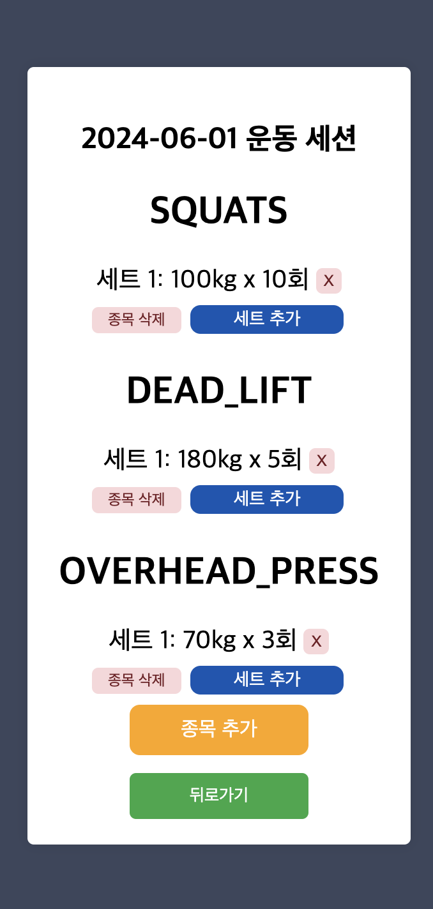
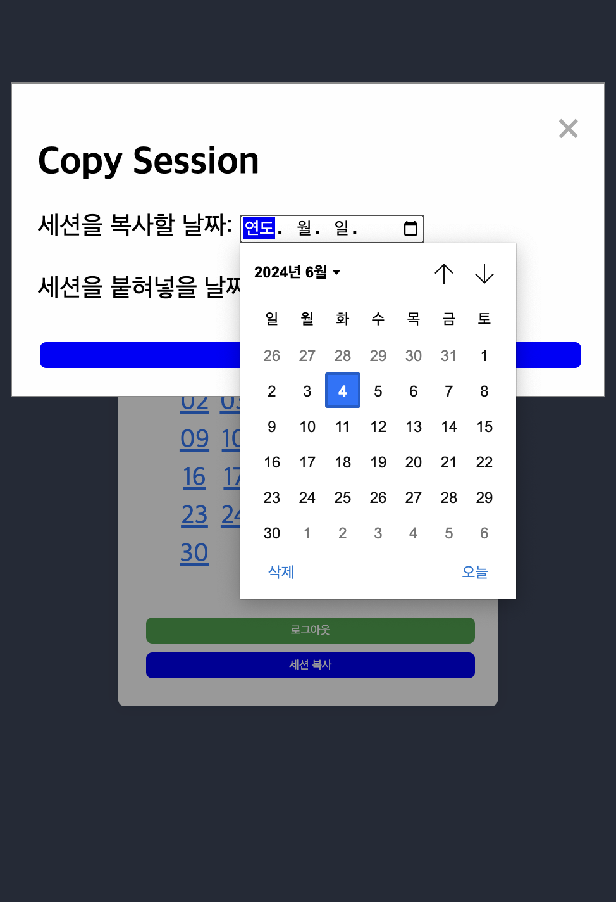

# Wodiary
 <br>
웨이트 훈련 기록용 웹 애플리케이션.

## 목차

- [소개](#소개)
- [기능](#기능)
- [설치](#설치)
- [사용법](#사용법)
- [연락처](#연락처)

## 소개

프로젝트 개요

이 프로그램은 사용자가 운동 계획을 관리하고 기록할 수 있는 웹 애플리케이션입니다. 효율적인 웨이트 프로그램 관리와 운동 세션을 기록하고 관리하며, 데이터를 시각화할 수 있는 것이 제 목표입니다. 추후 운동 데이터 분석 기능, 5X5 같은 파워리프팅 프로그램 기능도 추가할 예정입니다.

주요 기능

사용자 인증: 세션 기반 인증 시스템을 통해 사용자 데이터를 안전하게 보호합니다.
운동 세션 관리: 사용자는 각 운동 세션을 기록하고 관리할 수 있습니다.
운동 세트 관리: 각 운동 세션 내에서 운동 세트를 추가, 삭제할 수 있습니다.
데이터 시각화: 운동 데이터를 시각화하여 사용자가 자신의 성과를 쉽게 파악할 수 있습니다.
향후 기능: 5X5 파워리프팅 프로그램.

기술 스택

Backend: Spring Boot 3, JPA, Spring Security 6, WebSocket, Lombok  
Database: H2 (개발), MariaDB (프로덕션)  
Frontend: Thymeleaf, JavaScript, css, HTML  
Build Tool: Gradle  
IDE: IntelliJ IDEA Community Edition  

설치 및 실행

요구사항
Java 17 이상
Gradle

## 기능

- 기능1 : 원하는 날짜를 선택해 운동종목을 선택해서 세션에 넣을 수 있습니다.
- 기능2 : 선택한 운동을 기반으로 세트를 추가 혹은 삭제를 할 수 있습니다.
- 기능3 : 원하는 날짜를 선택해 다른날짜로 운동세션을 복사해 넣을 수 있습니다.

## 설치

1. 저장소를 클론합니다.
    ```bash
    git clone https://github.com/adsds126/wodiary.git
    cd wodiary
    ```
2. 필요한 의존성을 설치합니다.
    ```bash
    ./gradlew clean build
    ```
3. 애플리케이션을 실행합니다.
    ```bash
    ./gradlew bootRun
    ```
4. 브라우저에서 `localhost:8080/login`으로 접속합니다.


## 사용법
 <br>
1. 로그인화면에서 signup합니다. <br>
 <br>
2. 로그인을 하면 home으로 이동합니다. 원하는 날짜를 클릭합니다. 추가로 이달의 총 볼륨이 표시됩니다.<br>
 <br>
3. 운동종목이 보입니다. 스크롤하면서 원하는 종목들을 클릭해줍니다. <br>
 <br>
4. 원하는 운동종목에 세트를 추가해줍니다. <br>
 <br>
5. 세트추가 된 모습입니다. X버튼을 누르면 세트가 삭제되며 종목삭제 버튼을 누르면 종목이 삭제됩니다. <br>
 <br>
6. 운동 세션이 있는 날짜의 운동세션을 원하는 날에 붙혀넣을 수 있습니다. <br>


## 연락처

adsds126@gmail.com
